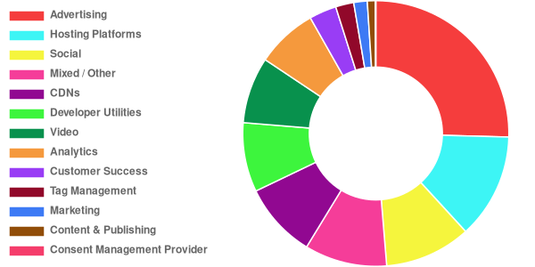

# [Third Party Web](https://www.thirdpartyweb.today/)

## Check out the shiny new web UI https://www.thirdpartyweb.today/

Data on third party entities and their impact on the web.

This document is a summary of which third party scripts are most responsible for excessive JavaScript execution on the web today.

## Table of Contents

1.  [Goals](#goals)
1.  [Methodology](#methodology)
1.  [NPM Module](#npm-module)
1.  [Updates](#updates)
1.  [Data](#data)
    1.  [Summary](#summary)
    1.  [How to Interpret](#how-to-interpret)
    1.  [Third Parties by Category](#by-category)
        1.  [Advertising](#ad)
        1.  [Analytics](#analytics)
        1.  [Social](#social)
        1.  [Video](#video)
        1.  [Developer Utilities](#utility)
        1.  [Hosting Platforms](#hosting)
        1.  [Marketing](#marketing)
        1.  [Customer Success](#customer-success)
        1.  [Content & Publishing](#content)
        1.  [CDNs](#cdn)
        1.  [Tag Management](#tag-manager)
        1.  [Mixed / Other](#other)
    1.  [Third Parties by Total Impact](#by-total-impact)
1.  [Future Work](#future-work)
1.  [FAQs](#faqs)
1.  [Contributing](#contributing)

## Goals

1.  Quantify the impact of third party scripts on the web.
1.  Identify the third party scripts on the web that have the greatest performance cost.
1.  Give developers the information they need to make informed decisions about which third parties to include on their sites.
1.  Incentivize responsible third party script behavior.
1.  Make this information accessible and useful.

## Methodology

[HTTP Archive](https://httparchive.org/) is an inititiave that tracks how the web is built. Every month, ~4 million sites are crawled with [Lighthouse](https://github.com/GoogleChrome/lighthouse) on mobile. Lighthouse breaks down the total script execution time of each page and attributes the execution to a URL. Using [BigQuery](https://cloud.google.com/bigquery/), this project aggregates the script execution to the origin-level and assigns each origin to the responsible entity.

## NPM Module

The entity classification data is available as an NPM module.

```js
const {getEntity} = require('third-party-web')
const entity = getEntity('https://d36mpcpuzc4ztk.cloudfront.net/js/visitor.js')
console.log(entity)
//   {
//     "name": "Freshdesk",
//     "homepage": "https://freshdesk.com/",
//     "categories": ["customer-success"],
//     "domains": ["d36mpcpuzc4ztk.cloudfront.net"]
//   }
```

## Updates

## 2019-02-01 dataset

Huge props to [WordAds](https://wordads.co/) for reducing their impact from ~2.5s to ~200ms on average! A few entities are showing considerably less data this cycle (Media Math, Crazy Egg, DoubleVerify, Bootstrap CDN). Perhaps they've added new CDNs/hostnames that we haven't identified or the basket of sites in HTTPArchive has shifted away from their usage.

## 2019-03-01 dataset

Almost 2,000 entities tracked now across ~3,000+ domains! Huge props to [@simonhearne](https://twitter.com/simonhearne) for making this massive increase possible. Tag Managers have now been split out into their own category since they represented such a large percentage of the "Mixed / Other" category.

## 2019-05-06 dataset

Google Ads clarified that `www.googletagservices.com` serves more ad scripts than generic tag management, and it has been reclassified accordingly. This has dropped the overall Tag Management share considerably back down to its earlier position.

## 2019-05-13 dataset

A shortcoming of the attribution approach has been fixed. Total usage is now reported based on the number of _pages_ in the dataset that use the third-party, not the number of _scripts_. Correspondingly, all average impact times are now reported _per page_ rather than _per script_. Previously, a third party could appear to have a lower impact or be more popular simply by splitting their work across multiple files.

Third-parties that performed most of their work from a single script should see little to no impact from this change, but some entities have seen significant ranking movement. Hosting providers that host entire pages are, understandably, the most affected.

Some notable changes below:

| Third-Party | Previously (per-script) | Now (per-page) |
| ----------- | ----------------------- | -------------- |
| Beeketing   | 137 ms                  | 465 ms         |
| Sumo        | 263 ms                  | 798 ms         |
| Tumblr      | 324 ms                  | 1499 ms        |
| Yandex APIs | 393 ms                  | 1231 ms        |
| Google Ads  | 402 ms                  | 1285 ms        |
| Wix         | 972 ms                  | 5393 ms        |

## Data

### Summary

Across top ~4 million sites, ~2700 origins account for ~57% of all script execution time with the top 50 entities already accounting for ~47%. Third party script execution is the majority chunk of the web today, and it's important to make informed choices.

### How to Interpret

Each entity has a number of data points available.

1.  **Usage (Total Number of Occurrences)** - how many scripts from their origins were included on pages
1.  **Total Impact (Total Execution Time)** - how many seconds were spent executing their scripts across the web
1.  **Average Impact (Average Execution Time)** - on average, how many milliseconds were spent executing each script
1.  **Category** - what type of script is this

<a name="by-category"></a>

### Third Parties by Category

This section breaks down third parties by category. The third parties in each category are ranked from first to last based on the average impact of their scripts. Perhaps the most important comparisons lie here. You always need to pick an analytics provider, but at least you can pick the most well-behaved analytics provider.

#### Overall Breakdown

Unsurprisingly, ads account for the largest identifiable chunk of third party script execution.



<a name="ad"></a>

#### Advertising

These scripts are part of advertising networks, either serving or measuring.

| Rank | Name                                                           | Usage     | Average Impact |
| ---- | -------------------------------------------------------------- | --------- | -------------- |
| 1    | DeepIntent                                                     | 8,215     | 6 ms           |
| 2    | Tapad                                                          | 5,471     | 6 ms           |
| 3    | RTB House AdPilot                                              | 7,741     | 10 ms          |
| 4    | ContextWeb                                                     | 1,007     | 12 ms          |
| 5    | OneTag                                                         | 5,941     | 16 ms          |
| 6    | [OpenX](https://www.openx.com/)                                | 59,327    | 21 ms          |
| 7    | TripleLift                                                     | 2,921     | 25 ms          |
| 8    | [F@N Communications](https://www.fancs.com/)                   | 2,741     | 30 ms          |
| 9    | [AppNexus](https://www.appnexus.com/)                          | 74,553    | 42 ms          |
| 10   | Microad                                                        | 2,067     | 51 ms          |
| 11   | Constant Contact                                               | 9,809     | 52 ms          |
| 12   | SiteScout                                                      | 5,879     | 53 ms          |
| 13   | MailMunch                                                      | 6,460     | 62 ms          |
| 14   | StackAdapt                                                     | 3,092     | 64 ms          |
| 15   | GumGum                                                         | 23,256    | 64 ms          |
| 16   | DialogTech SourceTrak                                          | 3,152     | 68 ms          |
| 17   | bRealTime                                                      | 1,036     | 69 ms          |
| 18   | Datonics                                                       | 3,139     | 70 ms          |
| 19   | Tribal Fusion                                                  | 10,576    | 71 ms          |
| 20   | Simpli.fi                                                      | 5,189     | 74 ms          |
| 21   | [The Trade Desk](https://www.thetradedesk.com/)                | 19,533    | 79 ms          |
| 22   | ExoClick                                                       | 2,794     | 79 ms          |
| 23   | Twitter Online Conversion Tracking                             | 2,141     | 81 ms          |
| 24   | Adform                                                         | 39,781    | 81 ms          |
| 25   | Nend                                                           | 3,520     | 89 ms          |
| 26   | Affiliate Window                                               | 3,857     | 91 ms          |
| 27   | District M                                                     | 38,802    | 94 ms          |
| 28   | [Scorecard Research](https://www.scorecardresearch.com/)       | 5,298     | 98 ms          |
| 29   | Drip                                                           | 2,202     | 100 ms         |
| 30   | Navegg                                                         | 2,070     | 105 ms         |
| 31   | Branch Metrics                                                 | 9,123     | 110 ms         |
| 32   | Sharethrough                                                   | 1,114     | 113 ms         |
| 33   | Rocket Fuel                                                    | 1,277     | 118 ms         |
| 34   | LinkedIn Ads                                                   | 10,365    | 119 ms         |
| 35   | Impact Radius                                                  | 1,268     | 122 ms         |
| 36   | AudienceSearch                                                 | 24,734    | 127 ms         |
| 37   | DTSCOUT                                                        | 40,794    | 128 ms         |
| 38   | Tradelab                                                       | 2,401     | 131 ms         |
| 39   | Teads                                                          | 16,654    | 139 ms         |
| 40   | Tynt                                                           | 96,288    | 152 ms         |
| 41   | IPONWEB                                                        | 3,672     | 160 ms         |
| 42   | DialogTech                                                     | 2,022     | 164 ms         |
| 43   | rewardStyle.com                                                | 1,138     | 173 ms         |
| 44   | Gemius                                                         | 16,228    | 177 ms         |
| 45   | BlueKai                                                        | 63,476    | 179 ms         |
| 46   | OwnerIQ                                                        | 2,577     | 183 ms         |
| 47   | [Amazon Ads](https://ad.amazon.com/)                           | 66,214    | 185 ms         |
| 48   | [Adroll](https://www.adroll.com/)                              | 25,634    | 193 ms         |
| 49   | i-mobile                                                       | 14,996    | 197 ms         |
| 50   | Tail Target                                                    | 1,734     | 204 ms         |
| 51   | Between Digital                                                | 2,591     | 204 ms         |
| 52   | Adscale                                                        | 1,073     | 205 ms         |
| 53   | Salesforce.com                                                 | 2,395     | 210 ms         |
| 54   | Unbounce                                                       | 7,526     | 215 ms         |
| 55   | FreakOut                                                       | 4,604     | 220 ms         |
| 56   | LINE Corporation                                               | 15,479    | 225 ms         |
| 57   | TrafficStars                                                   | 6,208     | 227 ms         |
| 58   | PushCrew                                                       | 2,157     | 230 ms         |
| 59   | Index Exchange                                                 | 30,166    | 232 ms         |
| 60   | fluct                                                          | 5,959     | 235 ms         |
| 61   | Rakuten Marketing                                              | 1,468     | 244 ms         |
| 62   | [Criteo](https://www.criteo.com/)                              | 97,368    | 265 ms         |
| 63   | STINGRAY                                                       | 2,955     | 265 ms         |
| 64   | sovrn                                                          | 3,490     | 274 ms         |
| 65   | Crowd Control                                                  | 36,879    | 287 ms         |
| 66   | [Bing Ads](https://bingads.microsoft.com)                      | 37,173    | 289 ms         |
| 67   | [Rubicon Project](https://rubiconproject.com/)                 | 120,372   | 308 ms         |
| 68   | JuicyAds                                                       | 3,222     | 311 ms         |
| 69   | Nativo                                                         | 1,239     | 322 ms         |
| 70   | [Outbrain](https://www.outbrain.com/)                          | 5,685     | 342 ms         |
| 71   | Talkable                                                       | 1,049     | 365 ms         |
| 72   | Geniee                                                         | 9,712     | 399 ms         |
| 73   | Auto Link Maker                                                | 1,275     | 402 ms         |
| 74   | VigLink                                                        | 37,739    | 420 ms         |
| 75   | Adocean                                                        | 1,066     | 433 ms         |
| 76   | Skimbit                                                        | 47,416    | 445 ms         |
| 77   | [Popads](https://www.popads.net/)                              | 1,635     | 451 ms         |
| 78   | Intercept Interactive                                          | 1,349     | 461 ms         |
| 79   | [Supership](https://supership.jp/)                             | 11,255    | 464 ms         |
| 80   | eBay                                                           | 1,167     | 485 ms         |
| 81   | Smart AdServer                                                 | 7,364     | 489 ms         |
| 82   | Privy                                                          | 17,138    | 490 ms         |
| 83   | Technorati                                                     | 1,064     | 493 ms         |
| 84   | Adloox                                                         | 3,090     | 498 ms         |
| 85   | [Yandex Ads](https://yandex.com/adv/)                          | 29,824    | 498 ms         |
| 86   | [Yahoo!](https://www.yahoo.com/)                               | 31,319    | 523 ms         |
| 87   | Simplicity Marketing                                           | 1,627     | 540 ms         |
| 88   | [Taboola](https://www.taboola.com/)                            | 36,778    | 572 ms         |
| 89   | Lytics                                                         | 1,152     | 586 ms         |
| 90   | [WordAds](https://wordads.co/)                                 | 49,677    | 590 ms         |
| 91   | GetResponse                                                    | 1,549     | 640 ms         |
| 92   | OptiMonk                                                       | 5,904     | 655 ms         |
| 93   | [Mediavine](https://www.mediavine.com/)                        | 7,621     | 660 ms         |
| 94   | Refersion                                                      | 3,176     | 756 ms         |
| 95   | Bizible                                                        | 1,538     | 814 ms         |
| 96   | [AOL / Oath / Verizon Media](https://www.oath.com/)            | 2,261     | 821 ms         |
| 97   | Permutive                                                      | 12,876    | 898 ms         |
| 98   | LoyaltyLion                                                    | 3,162     | 906 ms         |
| 99   | Klaviyo                                                        | 56,314    | 934 ms         |
| 100  | [Pubmatic](https://pubmatic.com/)                              | 121,606   | 936 ms         |
| 101  | [Media.net](https://www.media.net/)                            | 54,257    | 976 ms         |
| 102  | piano                                                          | 1,274     | 1343 ms        |
| 103  | [Moat](https://moat.com/)                                      | 12,195    | 1497 ms        |
| 104  | Sortable                                                       | 1,489     | 1528 ms        |
| 105  | [Attentive](https://attentivemobile.com/)                      | 4,352     | 1533 ms        |
| 106  | SpringServer                                                   | 1,318     | 1662 ms        |
| 107  | LongTail Ad Solutions                                          | 7,078     | 1973 ms        |
| 108  | Infolinks                                                      | 3,958     | 2033 ms        |
| 109  | [DoubleVerify](https://www.doubleverify.com/)                  | 1,992     | 2060 ms        |
| 110  | Admixer for Publishers                                         | 1,171     | 2080 ms        |
| 111  | [MGID](https://www.mgid.com/)                                  | 11,792    | 2518 ms        |
| 112  | StickyADS.tv                                                   | 2,659     | 3218 ms        |
| 113  | [fam](http://admin.fam-ad.com/report/)                         | 1,356     | 3414 ms        |
| 114  | [Integral Ad Science](https://integralads.com/uk/)             | 6,003     | 3510 ms        |
| 115  | Cxense                                                         | 3,979     | 3612 ms        |
| 116  | [Sizmek](https://www.sizmek.com/)                              | 4,254     | 3766 ms        |
| 117  | [Bridgewell DSP](https://www.bridgewell.com/)                  | 4,642     | 5106 ms        |
| 118  | [Google/Doubleclick Ads](https://www.doubleclickbygoogle.com/) | 1,067,927 | 5510 ms        |
| 119  | LKQD                                                           | 1,651     | 6634 ms        |

<a name="analytics"></a>

#### Analytics

These scripts measure or track users and their actions. There's a wide range in impact here depending on what's being tracked.

| Rank | Name                                                                         | Usage     | Average Impact |
| ---- | ---------------------------------------------------------------------------- | --------- | -------------- |
| 1    | [SpeedCurve LUX](https://speedcurve.com/features/lux/)                       | 1,102     | 52 ms          |
| 2    | [SalesLoft](https://salesloft.com/)                                          | 1,120     | 61 ms          |
| 3    | [WordPress Site Stats](https://wp.com/)                                      | 87,820    | 73 ms          |
| 4    | [Pingdom RUM](https://www.pingdom.com/product/performance-monitoring/)       | 1,732     | 73 ms          |
| 5    | Mouseflow                                                                    | 4,935     | 78 ms          |
| 6    | [Alexa](https://www.alexa.com/)                                              | 3,712     | 89 ms          |
| 7    | StatCounter                                                                  | 36,513    | 101 ms         |
| 8    | Roxr Software                                                                | 13,848    | 102 ms         |
| 9    | [Quantcast](https://www.quantcast.com)                                       | 60,617    | 124 ms         |
| 10   | KISSmetrics                                                                  | 1,374     | 126 ms         |
| 11   | Treasure Data                                                                | 9,194     | 126 ms         |
| 12   | [Crazy Egg](https://www.crazyegg.com/)                                       | 28,092    | 127 ms         |
| 13   | Woopra                                                                       | 1,420     | 127 ms         |
| 14   | IBM Acoustic Campaign                                                        | 1,110     | 157 ms         |
| 15   | CleverTap                                                                    | 1,069     | 157 ms         |
| 16   | Stamped.io                                                                   | 6,048     | 158 ms         |
| 17   | Reviews.co.uk                                                                | 1,930     | 159 ms         |
| 18   | Amplitude Mobile Analytics                                                   | 7,195     | 163 ms         |
| 19   | [Google Analytics](https://www.google.com/analytics/analytics/)              | 4,269,254 | 193 ms         |
| 20   | Searchanise                                                                  | 6,496     | 207 ms         |
| 21   | [Snowplow](https://snowplowanalytics.com/)                                   | 18,850    | 222 ms         |
| 22   | Heap                                                                         | 5,295     | 230 ms         |
| 23   | [Mixpanel](https://mixpanel.com/)                                            | 14,171    | 235 ms         |
| 24   | etracker                                                                     | 3,295     | 241 ms         |
| 25   | ResponseTap                                                                  | 1,230     | 242 ms         |
| 26   | [Matomo](https://matomo.org/)                                                | 1,193     | 242 ms         |
| 27   | Chartbeat                                                                    | 6,643     | 249 ms         |
| 28   | Marchex                                                                      | 7,438     | 262 ms         |
| 29   | CallRail                                                                     | 14,839    | 275 ms         |
| 30   | Smart Insight Tracking                                                       | 2,158     | 276 ms         |
| 31   | [LiveRamp IdentityLink](https://liveramp.com/discover-identitylink/)         | 4,823     | 299 ms         |
| 32   | [Nielsen NetRatings SiteCensus](http://www.nielsen-online.com/intlpage.html) | 15,756    | 340 ms         |
| 33   | Trust Pilot                                                                  | 24,309    | 351 ms         |
| 34   | Evidon                                                                       | 5,225     | 354 ms         |
| 35   | [Usabilla](https://usabilla.com)                                             | 1,399     | 377 ms         |
| 36   | [Marketo](https://www.marketo.com)                                           | 2,894     | 389 ms         |
| 37   | Parse.ly                                                                     | 6,563     | 419 ms         |
| 38   | [Baidu Analytics](https://tongji.baidu.com/web/welcome/login)                | 19,305    | 452 ms         |
| 39   | Net Reviews                                                                  | 3,959     | 452 ms         |
| 40   | [Hotjar](https://www.hotjar.com/)                                            | 239,318   | 476 ms         |
| 41   | [mPulse](https://developer.akamai.com/akamai-mpulse)                         | 20,717    | 482 ms         |
| 42   | [PageSense](https://www.zoho.com/pagesense/)                                 | 2,203     | 483 ms         |
| 43   | [Pendo](https://www.pendo.io)                                                | 2,486     | 509 ms         |
| 44   | Monetate                                                                     | 1,070     | 535 ms         |
| 45   | ForeSee                                                                      | 1,018     | 536 ms         |
| 46   | [VWO](https://vwo.com)                                                       | 6,377     | 560 ms         |
| 47   | Convert Insights                                                             | 1,215     | 578 ms         |
| 48   | ContentSquare                                                                | 1,863     | 592 ms         |
| 49   | Clerk.io ApS                                                                 | 1,438     | 595 ms         |
| 50   | FullStory                                                                    | 10,091    | 602 ms         |
| 51   | Nosto                                                                        | 1,603     | 617 ms         |
| 52   | [Segment](https://segment.com/)                                              | 13,313    | 647 ms         |
| 53   | Kampyle                                                                      | 1,218     | 728 ms         |
| 54   | Bazaarvoice                                                                  | 2,398     | 887 ms         |
| 55   | [Snapchat](https://www.snapchat.com)                                         | 24,781    | 945 ms         |
| 56   | [Optimizely](https://www.optimizely.com/)                                    | 27,758    | 963 ms         |
| 57   | SessionCam                                                                   | 2,104     | 1044 ms        |
| 58   | TrackJS                                                                      | 1,913     | 1134 ms        |
| 59   | [Lucky Orange](https://www.luckyorange.com/)                                 | 17,030    | 1221 ms        |
| 60   | PowerReviews                                                                 | 1,525     | 1247 ms        |
| 61   | Feefo.com                                                                    | 2,058     | 1252 ms        |
| 62   | [BounceX](https://www.bouncex.com/)                                          | 1,648     | 1285 ms        |
| 63   | Revolver Maps                                                                | 2,445     | 1406 ms        |
| 64   | [Salesforce](https://www.salesforce.com/products/marketing-cloud/)           | 6,386     | 1460 ms        |
| 65   | Gigya                                                                        | 2,359     | 1488 ms        |
| 66   | Inspectlet                                                                   | 5,607     | 1762 ms        |
| 67   | [Histats](http://histats.com/)                                               | 33,149    | 1955 ms        |
| 68   | [Yandex Metrica](https://metrica.yandex.com/about?)                          | 365,349   | 2005 ms        |
| 69   | Ezoic                                                                        | 2,248     | 2371 ms        |
| 70   | AB Tasty                                                                     | 2,451     | 4770 ms        |

<a name="social"></a>

#### Social

These scripts enable social features.

| Rank | Name                                        | Usage     | Average Impact |
| ---- | ------------------------------------------- | --------- | -------------- |
| 1    | [Instagram](https://www.instagram.com)      | 5,164     | 76 ms          |
| 2    | [AddToAny](https://www.addtoany.com/)       | 39,399    | 91 ms          |
| 3    | reddit                                      | 1,339     | 119 ms         |
| 4    | [Shareaholic](https://www.shareaholic.com/) | 2,188     | 120 ms         |
| 5    | [Pinterest](https://pinterest.com/)         | 107,585   | 149 ms         |
| 6    | [LinkedIn](https://www.linkedin.com/)       | 15,193    | 385 ms         |
| 7    | AddShoppers                                 | 1,406     | 436 ms         |
| 8    | [Facebook](https://www.facebook.com)        | 2,047,170 | 525 ms         |
| 9    | [Twitter](https://twitter.com)              | 305,943   | 548 ms         |
| 10   | [TikTok](https://www.tiktok.com/en/)        | 26,424    | 556 ms         |
| 11   | [ShareThis](https://www.sharethis.com/)     | 110,762   | 566 ms         |
| 12   | [VK](https://vk.com/)                       | 35,304    | 606 ms         |
| 13   | Kakao                                       | 25,256    | 697 ms         |
| 14   | [AddThis](http://www.addthis.com/)          | 123,088   | 1658 ms        |
| 15   | SocialShopWave                              | 3,043     | 2499 ms        |
| 16   | [PIXNET](https://www.pixnet.net/)           | 4,472     | 3121 ms        |
| 17   | [Disqus](http://disqus.com/)                | 1,105     | 3670 ms        |
| 18   | LiveJournal                                 | 4,399     | 4258 ms        |
| 19   | [Tumblr](https://tumblr.com/)               | 14,993    | 4475 ms        |

<a name="video"></a>

#### Video

These scripts enable video player and streaming functionality.

| Rank | Name                                         | Usage   | Average Impact |
| ---- | -------------------------------------------- | ------- | -------------- |
| 1    | [Twitch](https://twitch.tv/)                 | 1,061   | 80 ms          |
| 2    | [Vimeo](http://vimeo.com/)                   | 67,457  | 494 ms         |
| 3    | [Brightcove](https://www.brightcove.com/en/) | 8,431   | 1542 ms        |
| 4    | [Wistia](https://wistia.com/)                | 16,427  | 3236 ms        |
| 5    | [YouTube](https://youtube.com)               | 591,960 | 4599 ms        |

<a name="utility"></a>

#### Developer Utilities

These scripts are developer utilities (API clients, site monitoring, fraud detection, etc).

| Rank | Name                                                                      | Usage     | Average Impact |
| ---- | ------------------------------------------------------------------------- | --------- | -------------- |
| 1    | Key CDN                                                                   | 1,940     | 65 ms          |
| 2    | Rollbar                                                                   | 1,016     | 88 ms          |
| 3    | Siteimprove                                                               | 10,066    | 96 ms          |
| 4    | [New Relic](https://newrelic.com/)                                        | 164,741   | 111 ms         |
| 5    | Klevu Search                                                              | 1,446     | 113 ms         |
| 6    | Seznam                                                                    | 15,084    | 114 ms         |
| 7    | [Accessibe](https://accessibe.com/)                                       | 6,549     | 117 ms         |
| 8    | [Ipify](https://www.ipify.org)                                            | 1,267     | 153 ms         |
| 9    | iovation                                                                  | 1,552     | 181 ms         |
| 10   | Highcharts                                                                | 1,695     | 205 ms         |
| 11   | Hexton                                                                    | 22,886    | 228 ms         |
| 12   | LightWidget                                                               | 8,108     | 266 ms         |
| 13   | [TrustArc](https://www.trustarc.com/)                                     | 3,681     | 304 ms         |
| 14   | iubenda                                                                   | 28,012    | 307 ms         |
| 15   | GitHub                                                                    | 4,952     | 344 ms         |
| 16   | Cookie-Script.com                                                         | 3,497     | 362 ms         |
| 17   | Riskified                                                                 | 1,190     | 368 ms         |
| 18   | [Cookiebot](https://www.cookiebot.com/)                                   | 44,017    | 369 ms         |
| 19   | Bold Commerce                                                             | 17,385    | 397 ms         |
| 20   | Swiftype                                                                  | 1,621     | 398 ms         |
| 21   | Trusted Shops                                                             | 13,135    | 403 ms         |
| 22   | Affirm                                                                    | 4,430     | 442 ms         |
| 23   | [OneSignal](https://onesignal.com/)                                       | 63,837    | 444 ms         |
| 24   | WisePops                                                                  | 2,581     | 471 ms         |
| 25   | [AppDynamics](https://www.appdynamics.com/)                               | 2,786     | 516 ms         |
| 26   | [Other Google APIs/SDKs](https://developers.google.com/apis-explorer/#p/) | 1,718,531 | 549 ms         |
| 27   | GetSiteControl                                                            | 2,890     | 549 ms         |
| 28   | [Luigi’s Box](https://www.luigisbox.com/)                                 | 1,135     | 683 ms         |
| 29   | Forter                                                                    | 1,486     | 720 ms         |
| 30   | Fastly                                                                    | 23,597    | 747 ms         |
| 31   | [Amazon Pay](https://pay.amazon.com)                                      | 4,574     | 760 ms         |
| 32   | MaxCDN Enterprise                                                         | 2,702     | 921 ms         |
| 33   | [Cloudflare](https://www.cloudflare.com/website-optimization/)            | 130,967   | 947 ms         |
| 34   | [Google Maps](https://www.google.com/maps)                                | 622,845   | 975 ms         |
| 35   | [PayPal](https://paypal.com)                                              | 24,832    | 992 ms         |
| 36   | [GoDaddy](https://www.godaddy.com/)                                       | 22,571    | 1031 ms        |
| 37   | Google reCAPTCHA                                                          | 11,273    | 1095 ms        |
| 38   | Mapbox                                                                    | 9,933     | 1102 ms        |
| 39   | [Stripe](https://stripe.com)                                              | 40,633    | 1135 ms        |
| 40   | [Sentry](https://sentry.io/)                                              | 18,201    | 1178 ms        |
| 41   | Bugsnag                                                                   | 21,412    | 1527 ms        |
| 42   | [Vidyard](https://www.vidyard.com/)                                       | 1,199     | 1609 ms        |
| 43   | [Yandex APIs](https://yandex.ru/)                                         | 27,716    | 1826 ms        |
| 44   | Secomapp                                                                  | 3,693     | 2066 ms        |
| 45   | Rambler                                                                   | 13,162    | 2676 ms        |
| 46   | [Freshchat](https://www.freshworks.com/live-chat-software/)               | 5,774     | 3752 ms        |
| 47   | Esri ArcGIS                                                               | 1,714     | 5831 ms        |
| 48   | [POWr](https://www.powr.io)                                               | 23,670    | 6122 ms        |

<a name="hosting"></a>

#### Hosting Platforms

These scripts are from web hosting platforms (WordPress, Wix, Squarespace, etc). Note that in this category, this can sometimes be the entirety of script on the page, and so the "impact" rank might be misleading. In the case of WordPress, this just indicates the libraries hosted and served _by_ WordPress not all sites using self-hosted WordPress.

| Rank | Name                                                                                      | Usage   | Average Impact |
| ---- | ----------------------------------------------------------------------------------------- | ------- | -------------- |
| 1    | [Blogger](http://www.blogger.com/)                                                        | 157,544 | 173 ms         |
| 2    | Civic                                                                                     | 2,573   | 295 ms         |
| 3    | Rackspace                                                                                 | 1,182   | 530 ms         |
| 4    | [Dealer](https://www.dealer.com/)                                                         | 2,944   | 864 ms         |
| 5    | [WordPress](https://wp.com/)                                                              | 198,677 | 942 ms         |
| 6    | Ecwid                                                                                     | 2,815   | 1317 ms        |
| 7    | [Tilda](http://tilda.cc/)                                                                 | 17,582  | 2599 ms        |
| 8    | [Shopify](https://www.shopify.com/)                                                       | 194,778 | 2701 ms        |
| 9    | [Hatena Blog](https://hatenablog.com/)                                                    | 30,093  | 2947 ms        |
| 10   | [Salesforce Commerce Cloud](https://www.salesforce.com/products/commerce-cloud/overview/) | 3,023   | 3357 ms        |
| 11   | [Squarespace](https://www.squarespace.com/)                                               | 72,303  | 3508 ms        |
| 12   | [Weebly](https://www.weebly.com/)                                                         | 21,990  | 3792 ms        |
| 13   | [Wix](https://www.wix.com/)                                                               | 108,412 | 4207 ms        |
| 14   | [CDK Dealer Management](https://www.cdkglobal.com/us)                                     | 2,518   | 4272 ms        |
| 15   | [WebsiteBuilder.com](https://www.websitebuilder.com)                                      | 1,795   | 4906 ms        |

<a name="marketing"></a>

#### Marketing

These scripts are from marketing tools that add popups/newsletters/etc.

| Rank | Name                                        | Usage  | Average Impact |
| ---- | ------------------------------------------- | ------ | -------------- |
| 1    | Madison Logic                               | 1,185  | 86 ms          |
| 2    | Sojern                                      | 1,133  | 115 ms         |
| 3    | DemandBase                                  | 2,018  | 125 ms         |
| 4    | Pardot                                      | 3,121  | 150 ms         |
| 5    | [Beeketing](https://beeketing.com/)         | 3,443  | 219 ms         |
| 6    | [Albacross](https://albacross.com/)         | 2,216  | 238 ms         |
| 7    | [iZooto](https://www.izooto.com)            | 1,753  | 268 ms         |
| 8    | [RD Station](https://www.rdstation.com/en/) | 15,818 | 338 ms         |
| 9    | [Listrak](https://www.listrak.com/)         | 1,203  | 469 ms         |
| 10   | [Judge.me](https://judge.me/)               | 16,591 | 496 ms         |
| 11   | [Mailchimp](https://mailchimp.com/)         | 38,397 | 514 ms         |
| 12   | Bronto Software                             | 1,159  | 574 ms         |
| 13   | [Hubspot](https://hubspot.com/)             | 72,122 | 599 ms         |
| 14   | [Yotpo](https://www.yotpo.com/)             | 17,411 | 695 ms         |
| 15   | Ve                                          | 1,161  | 709 ms         |
| 16   | Wishpond Technologies                       | 1,054  | 901 ms         |
| 17   | [OptinMonster](https://optinmonster.com/)   | 6,031  | 1000 ms        |
| 18   | [PureCars](https://www.purecars.com/)       | 2,935  | 1736 ms        |
| 19   | [Sumo](https://sumo.com/)                   | 17,112 | 1940 ms        |
| 20   | Bigcommerce                                 | 13,990 | 2596 ms        |
| 21   | [Drift](https://www.drift.com/)             | 6,918  | 4862 ms        |
| 22   | [Tray Commerce](https://www.tray.com.br/)   | 7,123  | 16320 ms       |

<a name="customer-success"></a>

#### Customer Success

These scripts are from customer support/marketing providers that offer chat and contact solutions. These scripts are generally heavier in weight.

| Rank | Name                                             | Usage  | Average Impact |
| ---- | ------------------------------------------------ | ------ | -------------- |
| 1    | SnapEngage                                       | 1,642  | 116 ms         |
| 2    | Foursixty                                        | 1,774  | 232 ms         |
| 3    | BoldChat                                         | 1,858  | 259 ms         |
| 4    | ClickDesk                                        | 1,122  | 260 ms         |
| 5    | Pure Chat                                        | 5,799  | 442 ms         |
| 6    | LiveTex                                          | 1,173  | 489 ms         |
| 7    | [LivePerson](https://www.liveperson.com/)        | 4,413  | 723 ms         |
| 8    | Comm100                                          | 1,202  | 894 ms         |
| 9    | iPerceptions                                     | 5,009  | 1007 ms        |
| 10   | iAdvize SAS                                      | 1,004  | 1117 ms        |
| 11   | [Intercom](https://www.intercom.com)             | 17,889 | 1131 ms        |
| 12   | [Help Scout](https://www.helpscout.net/)         | 2,937  | 1266 ms        |
| 13   | [LiveChat](https://www.livechat.com/)            | 26,562 | 1288 ms        |
| 14   | [Smartsupp](https://www.smartsupp.com)           | 19,159 | 1350 ms        |
| 15   | [Tawk.to](https://www.tawk.to/)                  | 80,677 | 1436 ms        |
| 16   | [Jivochat](https://www.jivochat.com/)            | 59,712 | 1478 ms        |
| 17   | [ContactAtOnce](https://www.contactatonce.com/)  | 1,782  | 1551 ms        |
| 18   | [Tidio Live Chat](https://www.tidiochat.com/en/) | 23,553 | 1710 ms        |
| 19   | [ZenDesk](https://zendesk.com/)                  | 74,162 | 1880 ms        |
| 20   | [Olark](https://www.olark.com/)                  | 8,116  | 2013 ms        |
| 21   | Dynamic Yield                                    | 1,245  | 3936 ms        |

<a name="content"></a>

#### Content & Publishing

These scripts are from content providers or publishing-specific affiliate tracking.

| Rank | Name                                      | Usage  | Average Impact |
| ---- | ----------------------------------------- | ------ | -------------- |
| 1    | Accuweather                               | 1,500  | 186 ms         |
| 2    | TripAdvisor                               | 1,696  | 206 ms         |
| 3    | CPEx                                      | 1,223  | 255 ms         |
| 4    | OpenTable                                 | 3,557  | 346 ms         |
| 5    | Covert Pics                               | 2,223  | 353 ms         |
| 6    | SnapWidget                                | 9,532  | 364 ms         |
| 7    | Tencent                                   | 8,103  | 374 ms         |
| 8    | Booking.com                               | 1,888  | 418 ms         |
| 9    | Revcontent                                | 1,057  | 851 ms         |
| 10   | Cloudinary                                | 1,103  | 999 ms         |
| 11   | Embedly                                   | 4,531  | 1313 ms        |
| 12   | [AMP](https://amp.dev/)                   | 50,735 | 1414 ms        |
| 13   | [Spotify](https://www.spotify.com/)       | 4,699  | 1864 ms        |
| 14   | [Hotmart](https://www.hotmart.com/)       | 1,978  | 2219 ms        |
| 15   | [SoundCloud](https://www.soundcloud.com/) | 4,686  | 3208 ms        |
| 16   | issuu                                     | 2,518  | 3395 ms        |
| 17   | Medium                                    | 7,100  | 4112 ms        |
| 18   | Dailymotion                               | 2,591  | 7975 ms        |

<a name="cdn"></a>

#### CDNs

These are a mixture of publicly hosted open source libraries (e.g. jQuery) served over different public CDNs and private CDN usage. This category is unique in that the origin may have no responsibility for the performance of what's being served. Note that rank here does not imply one CDN is better than the other. It simply indicates that the scripts being served from that origin are lighter/heavier than the ones served by another.

| Rank | Name                                                         | Usage     | Average Impact |
| ---- | ------------------------------------------------------------ | --------- | -------------- |
| 1    | Cloud.typography                                             | 1,120     | 0 ms           |
| 2    | [Google Fonts](https://fonts.google.com/)                    | 158,837   | 0 ms           |
| 3    | [Bootstrap CDN](https://www.bootstrapcdn.com/)               | 49,086    | 30 ms          |
| 4    | Edge Web Fonts                                               | 1,358     | 111 ms         |
| 5    | [Adobe TypeKit](https://fonts.adobe.com/)                    | 69,454    | 140 ms         |
| 6    | [FontAwesome CDN](https://fontawesome.com/)                  | 150,831   | 185 ms         |
| 7    | Microsoft Hosted Libs                                        | 15,194    | 264 ms         |
| 8    | Monotype                                                     | 5,730     | 329 ms         |
| 9    | [Unpkg](https://unpkg.com)                                   | 40,363    | 420 ms         |
| 10   | [jQuery CDN](https://code.jquery.com/)                       | 366,249   | 478 ms         |
| 11   | [JSDelivr CDN](https://www.jsdelivr.com/)                    | 177,603   | 543 ms         |
| 12   | [Cloudflare CDN](https://cdnjs.com/)                         | 303,401   | 558 ms         |
| 13   | Fort Awesome                                                 | 1,445     | 568 ms         |
| 14   | [Akamai](https://www.akamai.com/)                            | 11,334    | 738 ms         |
| 15   | Azure Web Services                                           | 24,672    | 1011 ms        |
| 16   | [Google CDN](https://developers.google.com/speed/libraries/) | 1,788,607 | 1019 ms        |
| 17   | [Yandex CDN](https://yandex.ru/)                             | 94,853    | 1738 ms        |
| 18   | [CreateJS CDN](http://code.createjs.com/)                    | 4,398     | 5772 ms        |

<a name="tag-manager"></a>

#### Tag Management

These scripts tend to load lots of other scripts and initiate many tasks.

| Rank | Name                                                                          | Usage     | Average Impact |
| ---- | ----------------------------------------------------------------------------- | --------- | -------------- |
| 1    | [Google Tag Manager](https://marketingplatform.google.com/about/tag-manager/) | 2,960,912 | 265 ms         |
| 2    | [BrightTag / Signal](https://www.signal.co)                                   | 6,022     | 311 ms         |
| 3    | TagCommander                                                                  | 1,406     | 368 ms         |
| 4    | [Tealium](https://tealium.com/)                                               | 22,731    | 849 ms         |
| 5    | [Adobe Tag Manager](https://www.adobe.com/experience-platform/)               | 43,692    | 1069 ms        |
| 6    | [Ensighten](https://www.ensighten.com/)                                       | 4,365     | 1186 ms        |


<a name="other"></a>

#### Mixed / Other

These are miscellaneous scripts delivered via a shared origin with no precise category or attribution. Help us out by identifying more origins!

| Rank | Name                                                                | Usage     | Average Impact |
| ---- | ------------------------------------------------------------------- | --------- | -------------- |
| 1    | Polyfill service                                                    | 1,688     | 61 ms          |
| 2    | Browser-Update.org                                                  | 1,209     | 68 ms          |
| 3    | ResponsiveVoice                                                     | 2,692     | 98 ms          |
| 4    | [ReadSpeaker](https://www.readspeaker.com)                          | 3,995     | 125 ms         |
| 5    | [Parking Crew](http://parkingcrew.net/)                             | 4,895     | 341 ms         |
| 6    | Skype                                                               | 1,147     | 356 ms         |
| 7    | [Amazon Web Services](https://aws.amazon.com/s3/)                   | 68,597    | 400 ms         |
| 8    | [Browsealoud](https://www.texthelp.com/en-gb/products/browsealoud/) | 1,728     | 460 ms         |
| 9    | [All Other 3rd Parties](#by-category)                               | 3,754,138 | 719 ms         |
| 10   | Pagely                                                              | 1,154     | 753 ms         |
| 11   | Heroku                                                              | 8,470     | 2820 ms        |
| 12   | uLogin                                                              | 2,500     | 2959 ms        |

<a name="by-total-impact"></a>

### Third Parties by Total Impact

This section highlights the entities responsible for the most script execution across the web. This helps inform which improvements would have the largest total impact.

| Name                                                                                      | Popularity | Total Impact | Average Impact |
| ----------------------------------------------------------------------------------------- | ---------- | ------------ | -------------- |
| [Google/Doubleclick Ads](https://www.doubleclickbygoogle.com/)                            | 1,067,927  | 5,884,306 s  | 5510 ms        |
| [YouTube](https://youtube.com)                                                            | 591,960    | 2,722,269 s  | 4599 ms        |
| [All Other 3rd Parties](#by-category)                                                     | 3,754,138  | 2,700,451 s  | 719 ms         |
| [Google CDN](https://developers.google.com/speed/libraries/)                              | 1,788,607  | 1,822,211 s  | 1019 ms        |
| [Facebook](https://www.facebook.com)                                                      | 2,047,170  | 1,075,501 s  | 525 ms         |
| [Other Google APIs/SDKs](https://developers.google.com/apis-explorer/#p/)                 | 1,718,531  | 943,227 s    | 549 ms         |
| [Google Analytics](https://www.google.com/analytics/analytics/)                           | 4,269,254  | 823,853 s    | 193 ms         |
| [Google Tag Manager](https://marketingplatform.google.com/about/tag-manager/)             | 2,960,912  | 784,372 s    | 265 ms         |
| [Yandex Metrica](https://metrica.yandex.com/about?)                                       | 365,349    | 732,593 s    | 2005 ms        |
| [Google Maps](https://www.google.com/maps)                                                | 622,845    | 607,388 s    | 975 ms         |
| [Shopify](https://www.shopify.com/)                                                       | 194,778    | 526,005 s    | 2701 ms        |
| [Wix](https://www.wix.com/)                                                               | 108,412    | 456,119 s    | 4207 ms        |
| [Squarespace](https://www.squarespace.com/)                                               | 72,303     | 253,629 s    | 3508 ms        |
| [AddThis](http://www.addthis.com/)                                                        | 123,088    | 204,095 s    | 1658 ms        |
| [WordPress](https://wp.com/)                                                              | 198,677    | 187,148 s    | 942 ms         |
| [jQuery CDN](https://code.jquery.com/)                                                    | 366,249    | 175,201 s    | 478 ms         |
| [Cloudflare CDN](https://cdnjs.com/)                                                      | 303,401    | 169,261 s    | 558 ms         |
| [Twitter](https://twitter.com)                                                            | 305,943    | 167,508 s    | 548 ms         |
| [Yandex CDN](https://yandex.ru/)                                                          | 94,853     | 164,807 s    | 1738 ms        |
| [POWr](https://www.powr.io)                                                               | 23,670     | 144,901 s    | 6122 ms        |
| [ZenDesk](https://zendesk.com/)                                                           | 74,162     | 139,444 s    | 1880 ms        |
| [Cloudflare](https://www.cloudflare.com/website-optimization/)                            | 130,967    | 124,023 s    | 947 ms         |
| [Tray Commerce](https://www.tray.com.br/)                                                 | 7,123      | 116,251 s    | 16320 ms       |
| [Tawk.to](https://www.tawk.to/)                                                           | 80,677     | 115,867 s    | 1436 ms        |
| [Hotjar](https://www.hotjar.com/)                                                         | 239,318    | 114,030 s    | 476 ms         |
| [Pubmatic](https://pubmatic.com/)                                                         | 121,606    | 113,871 s    | 936 ms         |
| [JSDelivr CDN](https://www.jsdelivr.com/)                                                 | 177,603    | 96,366 s     | 543 ms         |
| [Hatena Blog](https://hatenablog.com/)                                                    | 30,093     | 88,692 s     | 2947 ms        |
| [Jivochat](https://www.jivochat.com/)                                                     | 59,712     | 88,265 s     | 1478 ms        |
| [Weebly](https://www.weebly.com/)                                                         | 21,990     | 83,382 s     | 3792 ms        |
| [AMP](https://amp.dev/)                                                                   | 50,735     | 71,742 s     | 1414 ms        |
| [Tumblr](https://tumblr.com/)                                                             | 14,993     | 67,095 s     | 4475 ms        |
| [Histats](http://histats.com/)                                                            | 33,149     | 64,791 s     | 1955 ms        |
| [ShareThis](https://www.sharethis.com/)                                                   | 110,762    | 62,714 s     | 566 ms         |
| [Wistia](https://wistia.com/)                                                             | 16,427     | 53,150 s     | 3236 ms        |
| [Media.net](https://www.media.net/)                                                       | 54,257     | 52,964 s     | 976 ms         |
| Klaviyo                                                                                   | 56,314     | 52,622 s     | 934 ms         |
| [Yandex APIs](https://yandex.ru/)                                                         | 27,716     | 50,613 s     | 1826 ms        |
| [Adobe Tag Manager](https://www.adobe.com/experience-platform/)                           | 43,692     | 46,708 s     | 1069 ms        |
| [Stripe](https://stripe.com)                                                              | 40,633     | 46,115 s     | 1135 ms        |
| [Tilda](http://tilda.cc/)                                                                 | 17,582     | 45,689 s     | 2599 ms        |
| [Hubspot](https://hubspot.com/)                                                           | 72,122     | 43,216 s     | 599 ms         |
| [Tidio Live Chat](https://www.tidiochat.com/en/)                                          | 23,553     | 40,286 s     | 1710 ms        |
| [Rubicon Project](https://rubiconproject.com/)                                            | 120,372    | 37,018 s     | 308 ms         |
| Bigcommerce                                                                               | 13,990     | 36,320 s     | 2596 ms        |
| Rambler                                                                                   | 13,162     | 35,228 s     | 2676 ms        |
| [LiveChat](https://www.livechat.com/)                                                     | 26,562     | 34,204 s     | 1288 ms        |
| [Drift](https://www.drift.com/)                                                           | 6,918      | 33,636 s     | 4862 ms        |
| [Vimeo](http://vimeo.com/)                                                                | 67,457     | 33,336 s     | 494 ms         |
| [Sumo](https://sumo.com/)                                                                 | 17,112     | 33,198 s     | 1940 ms        |
| Bugsnag                                                                                   | 21,412     | 32,697 s     | 1527 ms        |
| [MGID](https://www.mgid.com/)                                                             | 11,792     | 29,687 s     | 2518 ms        |
| [WordAds](https://wordads.co/)                                                            | 49,677     | 29,292 s     | 590 ms         |
| Medium                                                                                    | 7,100      | 29,192 s     | 4112 ms        |
| [OneSignal](https://onesignal.com/)                                                       | 63,837     | 28,361 s     | 444 ms         |
| [FontAwesome CDN](https://fontawesome.com/)                                               | 150,831    | 27,966 s     | 185 ms         |
| [Amazon Web Services](https://aws.amazon.com/s3/)                                         | 68,597     | 27,420 s     | 400 ms         |
| [Blogger](http://www.blogger.com/)                                                        | 157,544    | 27,273 s     | 173 ms         |
| [Optimizely](https://www.optimizely.com/)                                                 | 27,758     | 26,719 s     | 963 ms         |
| [Smartsupp](https://www.smartsupp.com)                                                    | 19,159     | 25,869 s     | 1350 ms        |
| [Criteo](https://www.criteo.com/)                                                         | 97,368     | 25,817 s     | 265 ms         |
| [CreateJS CDN](http://code.createjs.com/)                                                 | 4,398      | 25,387 s     | 5772 ms        |
| Azure Web Services                                                                        | 24,672     | 24,955 s     | 1011 ms        |
| [PayPal](https://paypal.com)                                                              | 24,832     | 24,623 s     | 992 ms         |
| Heroku                                                                                    | 8,470      | 23,885 s     | 2820 ms        |
| [Bridgewell DSP](https://www.bridgewell.com/)                                             | 4,642      | 23,702 s     | 5106 ms        |
| [Snapchat](https://www.snapchat.com)                                                      | 24,781     | 23,416 s     | 945 ms         |
| [GoDaddy](https://www.godaddy.com/)                                                       | 22,571     | 23,263 s     | 1031 ms        |
| [Optanon](https://www.cookielaw.org/)                                                     | 45,294     | 21,769 s     | 481 ms         |
| [Freshchat](https://www.freshworks.com/live-chat-software/)                               | 5,774      | 21,663 s     | 3752 ms        |
| [Sentry](https://sentry.io/)                                                              | 18,201     | 21,438 s     | 1178 ms        |
| [VK](https://vk.com/)                                                                     | 35,304     | 21,384 s     | 606 ms         |
| Skimbit                                                                                   | 47,416     | 21,111 s     | 445 ms         |
| [Integral Ad Science](https://integralads.com/uk/)                                        | 6,003      | 21,072 s     | 3510 ms        |
| [Taboola](https://www.taboola.com/)                                                       | 36,778     | 21,055 s     | 572 ms         |
| [Lucky Orange](https://www.luckyorange.com/)                                              | 17,030     | 20,798 s     | 1221 ms        |
| Dailymotion                                                                               | 2,591      | 20,664 s     | 7975 ms        |
| [Intercom](https://www.intercom.com)                                                      | 17,889     | 20,236 s     | 1131 ms        |
| [Mailchimp](https://mailchimp.com/)                                                       | 38,397     | 19,750 s     | 514 ms         |
| [Tealium](https://tealium.com/)                                                           | 22,731     | 19,295 s     | 849 ms         |
| [Quantcast Choice](https://quantcast.com)                                                 | 24,648     | 19,212 s     | 779 ms         |
| LiveJournal                                                                               | 4,399      | 18,729 s     | 4258 ms        |
| [Moat](https://moat.com/)                                                                 | 12,195     | 18,256 s     | 1497 ms        |
| [New Relic](https://newrelic.com/)                                                        | 164,741    | 18,245 s     | 111 ms         |
| Fastly                                                                                    | 23,597     | 17,627 s     | 747 ms         |
| Kakao                                                                                     | 25,256     | 17,605 s     | 697 ms         |
| [Unpkg](https://unpkg.com)                                                                | 40,363     | 16,951 s     | 420 ms         |
| [Yahoo!](https://www.yahoo.com/)                                                          | 31,319     | 16,389 s     | 523 ms         |
| [Olark](https://www.olark.com/)                                                           | 8,116      | 16,339 s     | 2013 ms        |
| [Cookiebot](https://www.cookiebot.com/)                                                   | 44,017     | 16,260 s     | 369 ms         |
| [Sizmek](https://www.sizmek.com/)                                                         | 4,254      | 16,020 s     | 3766 ms        |
| [Pinterest](https://pinterest.com/)                                                       | 107,585    | 15,976 s     | 149 ms         |
| VigLink                                                                                   | 37,739     | 15,840 s     | 420 ms         |
| [SoundCloud](https://www.soundcloud.com/)                                                 | 4,686      | 15,030 s     | 3208 ms        |
| [Yandex Ads](https://yandex.com/adv/)                                                     | 29,824     | 14,851 s     | 498 ms         |
| [TikTok](https://www.tiktok.com/en/)                                                      | 26,424     | 14,689 s     | 556 ms         |
| Tynt                                                                                      | 96,288     | 14,600 s     | 152 ms         |
| Cxense                                                                                    | 3,979      | 14,373 s     | 3612 ms        |
| LongTail Ad Solutions                                                                     | 7,078      | 13,967 s     | 1973 ms        |
| [PIXNET](https://www.pixnet.net/)                                                         | 4,472      | 13,957 s     | 3121 ms        |
| [Brightcove](https://www.brightcove.com/en/)                                              | 8,431      | 13,005 s     | 1542 ms        |
| Google reCAPTCHA                                                                          | 11,273     | 12,339 s     | 1095 ms        |
| [Amazon Ads](https://ad.amazon.com/)                                                      | 66,214     | 12,257 s     | 185 ms         |
| [Yotpo](https://www.yotpo.com/)                                                           | 17,411     | 12,098 s     | 695 ms         |
| AB Tasty                                                                                  | 2,451      | 11,691 s     | 4770 ms        |
| Permutive                                                                                 | 12,876     | 11,561 s     | 898 ms         |
| BlueKai                                                                                   | 63,476     | 11,380 s     | 179 ms         |
| LKQD                                                                                      | 1,651      | 10,952 s     | 6634 ms        |
| Mapbox                                                                                    | 9,933      | 10,947 s     | 1102 ms        |
| [CDK Dealer Management](https://www.cdkglobal.com/us)                                     | 2,518      | 10,757 s     | 4272 ms        |
| [Bing Ads](https://bingads.microsoft.com)                                                 | 37,173     | 10,747 s     | 289 ms         |
| Crowd Control                                                                             | 36,879     | 10,599 s     | 287 ms         |
| [Salesforce Commerce Cloud](https://www.salesforce.com/products/commerce-cloud/overview/) | 3,023      | 10,148 s     | 3357 ms        |
| Esri ArcGIS                                                                               | 1,714      | 9,995 s      | 5831 ms        |
| [mPulse](https://developer.akamai.com/akamai-mpulse)                                      | 20,717     | 9,984 s      | 482 ms         |
| Inspectlet                                                                                | 5,607      | 9,879 s      | 1762 ms        |
| [Adobe TypeKit](https://fonts.adobe.com/)                                                 | 69,454     | 9,709 s      | 140 ms         |
| [Salesforce](https://www.salesforce.com/products/marketing-cloud/)                        | 6,386      | 9,321 s      | 1460 ms        |
| [WebsiteBuilder.com](https://www.websitebuilder.com)                                      | 1,795      | 8,806 s      | 4906 ms        |
| [Spotify](https://www.spotify.com/)                                                       | 4,699      | 8,758 s      | 1864 ms        |
| [Baidu Analytics](https://tongji.baidu.com/web/welcome/login)                             | 19,305     | 8,729 s      | 452 ms         |
| [Segment](https://segment.com/)                                                           | 13,313     | 8,615 s      | 647 ms         |
| iubenda                                                                                   | 28,012     | 8,594 s      | 307 ms         |
| StickyADS.tv                                                                              | 2,659      | 8,556 s      | 3218 ms        |
| issuu                                                                                     | 2,518      | 8,549 s      | 3395 ms        |
| Trust Pilot                                                                               | 24,309     | 8,539 s      | 351 ms         |
| Privy                                                                                     | 17,138     | 8,406 s      | 490 ms         |
| [Akamai](https://www.akamai.com/)                                                         | 11,334     | 8,369 s      | 738 ms         |
| [Judge.me](https://judge.me/)                                                             | 16,591     | 8,230 s      | 496 ms         |
| Infolinks                                                                                 | 3,958      | 8,045 s      | 2033 ms        |
| Secomapp                                                                                  | 3,693      | 7,629 s      | 2066 ms        |
| SocialShopWave                                                                            | 3,043      | 7,605 s      | 2499 ms        |
| [Quantcast](https://www.quantcast.com)                                                    | 60,617     | 7,514 s      | 124 ms         |
| uLogin                                                                                    | 2,500      | 7,397 s      | 2959 ms        |
| Index Exchange                                                                            | 30,166     | 7,011 s      | 232 ms         |
| Bold Commerce                                                                             | 17,385     | 6,898 s      | 397 ms         |
| [Attentive](https://attentivemobile.com/)                                                 | 4,352      | 6,671 s      | 1533 ms        |
| [WordPress Site Stats](https://wp.com/)                                                   | 87,820     | 6,382 s      | 73 ms          |
| FullStory                                                                                 | 10,091     | 6,076 s      | 602 ms         |
| [OptinMonster](https://optinmonster.com/)                                                 | 6,031      | 6,031 s      | 1000 ms        |
| Embedly                                                                                   | 4,531      | 5,948 s      | 1313 ms        |
| [LinkedIn](https://www.linkedin.com/)                                                     | 15,193     | 5,853 s      | 385 ms         |
| [Nielsen NetRatings SiteCensus](http://www.nielsen-online.com/intlpage.html)              | 15,756     | 5,354 s      | 340 ms         |
| [RD Station](https://www.rdstation.com/en/)                                               | 15,818     | 5,354 s      | 338 ms         |
| Ezoic                                                                                     | 2,248      | 5,330 s      | 2371 ms        |
| Trusted Shops                                                                             | 13,135     | 5,298 s      | 403 ms         |
| [Supership](https://supership.jp/)                                                        | 11,255     | 5,227 s      | 464 ms         |
| DTSCOUT                                                                                   | 40,794     | 5,226 s      | 128 ms         |
| Hexton                                                                                    | 22,886     | 5,216 s      | 228 ms         |
| [Ensighten](https://www.ensighten.com/)                                                   | 4,365      | 5,177 s      | 1186 ms        |
| [PureCars](https://www.purecars.com/)                                                     | 2,935      | 5,096 s      | 1736 ms        |
| iPerceptions                                                                              | 5,009      | 5,046 s      | 1007 ms        |
| [Mediavine](https://www.mediavine.com/)                                                   | 7,621      | 5,032 s      | 660 ms         |
| [Adroll](https://www.adroll.com/)                                                         | 25,634     | 4,944 s      | 193 ms         |
| Dynamic Yield                                                                             | 1,245      | 4,901 s      | 3936 ms        |
| [fam](http://admin.fam-ad.com/report/)                                                    | 1,356      | 4,629 s      | 3414 ms        |
| [Hotmart](https://www.hotmart.com/)                                                       | 1,978      | 4,389 s      | 2219 ms        |
| [Snowplow](https://snowplowanalytics.com/)                                                | 18,850     | 4,181 s      | 222 ms         |
| [DoubleVerify](https://www.doubleverify.com/)                                             | 1,992      | 4,104 s      | 2060 ms        |
| CallRail                                                                                  | 14,839     | 4,074 s      | 275 ms         |
| [Disqus](http://disqus.com/)                                                              | 1,105      | 4,055 s      | 3670 ms        |
| Microsoft Hosted Libs                                                                     | 15,194     | 4,012 s      | 264 ms         |
| Geniee                                                                                    | 9,712      | 3,875 s      | 399 ms         |
| OptiMonk                                                                                  | 5,904      | 3,869 s      | 655 ms         |
| Yieldify                                                                                  | 624        | 3,835 s      | 6146 ms        |
| [Help Scout](https://www.helpscout.net/)                                                  | 2,937      | 3,718 s      | 1266 ms        |
| Ecwid                                                                                     | 2,815      | 3,708 s      | 1317 ms        |
| StatCounter                                                                               | 36,513     | 3,693 s      | 101 ms         |
| District M                                                                                | 38,802     | 3,640 s      | 94 ms          |
| Smart AdServer                                                                            | 7,364      | 3,604 s      | 489 ms         |
| [AddToAny](https://www.addtoany.com/)                                                     | 39,399     | 3,601 s      | 91 ms          |
| [VWO](https://vwo.com)                                                                    | 6,377      | 3,570 s      | 560 ms         |
| [Crazy Egg](https://www.crazyegg.com/)                                                    | 28,092     | 3,565 s      | 127 ms         |
| Gigya                                                                                     | 2,359      | 3,509 s      | 1488 ms        |
| LINE Corporation                                                                          | 15,479     | 3,486 s      | 225 ms         |
| [Amazon Pay](https://pay.amazon.com)                                                      | 4,574      | 3,476 s      | 760 ms         |
| SnapWidget                                                                                | 9,532      | 3,469 s      | 364 ms         |
| Revolver Maps                                                                             | 2,445      | 3,438 s      | 1406 ms        |
| [Mixpanel](https://mixpanel.com/)                                                         | 14,171     | 3,337 s      | 235 ms         |
| Adform                                                                                    | 39,781     | 3,238 s      | 81 ms          |
| [LivePerson](https://www.liveperson.com/)                                                 | 4,413      | 3,192 s      | 723 ms         |
| AudienceSearch                                                                            | 24,734     | 3,153 s      | 127 ms         |
| [AppNexus](https://www.appnexus.com/)                                                     | 74,553     | 3,124 s      | 42 ms          |
| Tencent                                                                                   | 8,103      | 3,030 s      | 374 ms         |
| i-mobile                                                                                  | 14,996     | 2,952 s      | 197 ms         |
| LoyaltyLion                                                                               | 3,162      | 2,866 s      | 906 ms         |
| Gemius                                                                                    | 16,228     | 2,866 s      | 177 ms         |
| [AdRoll CMP](https://www.adroll.com/)                                                     | 24,297     | 2,805 s      | 115 ms         |
| [ContactAtOnce](https://www.contactatonce.com/)                                           | 1,782      | 2,764 s      | 1551 ms        |
| Parse.ly                                                                                  | 6,563      | 2,748 s      | 419 ms         |
| [ShareThis CMP](https://sharethis.com)                                                    | 94,243     | 2,653 s      | 28 ms          |
| Feefo.com                                                                                 | 2,058      | 2,577 s      | 1252 ms        |
| Pure Chat                                                                                 | 5,799      | 2,565 s      | 442 ms         |
| [Dealer](https://www.dealer.com/)                                                         | 2,944      | 2,543 s      | 864 ms         |
| MaxCDN Enterprise                                                                         | 2,702      | 2,488 s      | 921 ms         |
| Admixer for Publishers                                                                    | 1,171      | 2,436 s      | 2080 ms        |
| Refersion                                                                                 | 3,176      | 2,401 s      | 756 ms         |
| Okas Concepts                                                                             | 657        | 2,384 s      | 3628 ms        |
| Adyen                                                                                     | 786        | 2,325 s      | 2958 ms        |
| Teads                                                                                     | 16,654     | 2,317 s      | 139 ms         |

## Future Work

1.  Introduce URL-level data for more fine-grained analysis, i.e. which libraries from Cloudflare/Google CDNs are most expensive.
1.  Expand the scope, i.e. include more third parties and have greater entity/category coverage.

## FAQs

### I don't see entity X in the list. What's up with that?

This can be for one of several reasons:

1.  The entity does not have references to their origin on at least 50 pages in the dataset.
1.  The entity's origins have not yet been identified. See [How can I contribute?](#contribute)

### What is "Total Occurences"?

Total Occurrences is the number of pages on which the entity is included.

### How is the "Average Impact" determined?

The HTTP Archive dataset includes Lighthouse reports for each URL on mobile. Lighthouse has an audit called "bootup-time" that summarizes the amount of time that each script spent on the main thread. The "Average Impact" for an entity is the total execution time of scripts whose domain matches one of the entity's domains divided by the total number of pages that included the entity.

```
Average Impact = Total Execution Time / Total Occurrences
```

### How does Lighthouse determine the execution time of each script?

Lighthouse's bootup time audit attempts to attribute all toplevel main-thread tasks to a URL. A main thread task is attributed to the first script URL found in the stack. If you're interested in helping us improve this logic, see [Contributing](#contributing) for details.

### The data for entity X seems wrong. How can it be corrected?

Verify that the origins in `data/entities.js` are correct. Most issues will simply be the result of mislabelling of shared origins. If everything checks out, there is likely no further action and the data is valid. If you still believe there's errors, file an issue to discuss futher.

<a name="contribute"></a>

### How can I contribute?

Only about 90% of the third party script execution has been assigned to an entity. We could use your help identifying the rest! See [Contributing](#contributing) for details.

## Contributing

### Thanks

A **huge** thanks to [@simonhearne](https://twitter.com/simonhearne) and [@soulgalore](https://twitter.com/soulislove) for their assistance in classifying additional domains!

### Updating the Entities

The domain->entity mapping can be found in `data/entities.js`. Adding a new entity is as simple as adding a new array item with the following form.

```js
{
    "name": "Facebook",
    "homepage": "https://www.facebook.com",
    "categories": ["social"],
    "domains": [
        "*.facebook.com",
        "*.fbcdn.net"
    ],
    "examples": [
        "www.facebook.com",
        "connect.facebook.net",
        "staticxx.facebook.com",
        "static.xx.fbcdn.net",
        "m.facebook.com"
    ]
}
```

### Updating Attribution Logic

The logic for attribution to individual script URLs can be found in the [Lighthouse repo](https://github.com/GoogleChrome/lighthouse). File an issue over there to discuss further.

### Updating the Data

You need to have a BigQuery project called `lighthouse-infrastructure` with a dataset called `third_party_web`
The queries used to compute the data are in the `sql/` directory.

1. Edit `all-observed-domains-query.sql` to query the correct month's HTTPArchive run.
1. Run `all-observed-domains-query.sql` in BigQuery.
1. Download the results and check them in at `data/YYYY-MM-01-observed-domains.json`.
1. Edit `bootup-time-scripting.partial.sql` to query the correct month's HTTPArchive run.
1. Run `yarn build` to regenerate the latest canonical domain mapping.
1. Create a new table in `lighthouse-infrastructure.third_party_web` BigQuery table of the format `YYYY_MM_01` with the csv in `dist/domain-map.csv` with three columns `domain`, `canonicalDomain`, and `category`.
1. Run `origin-query.generated.sql` in BigQuery.
1. Download the results and check them in at `data/YYYY-MM-01-origin-scripting.json`.
1. Edit `bootup-time-scripting.partial.sql` to join on the table you just created.
1. Run `yarn build` to regenerate the queries.
1. Run `entity-per-page.generated.sql` in BigQuery.
1. Download the results and check them in at `data/YYYY-MM-01-entity-scripting.json`.
1. Run `web-almanac-all-observed-domains-identification.sql` in BigQuery.
1. Save the results to a BigQuery table `YYYY_MM_01_all_observed_domains`.

### Updating this README

This README is auto-generated from the templates `lib/` and the computed data. In order to update the charts, you'll need to make sure you have `cairo` installed locally in addition to `yarn install`.

```bash
# Install `cairo` and dependencies for node-canvas
brew install pkg-config cairo pango libpng jpeg giflib
# Build the requirements in this repo
yarn build
# Regenerate the README
yarn start
```

### Updating the website

The web code is located in `www/` directory of this repository. Open a PR to make changes.
